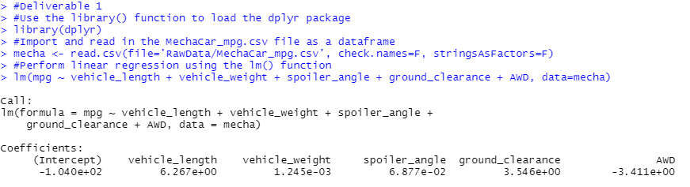
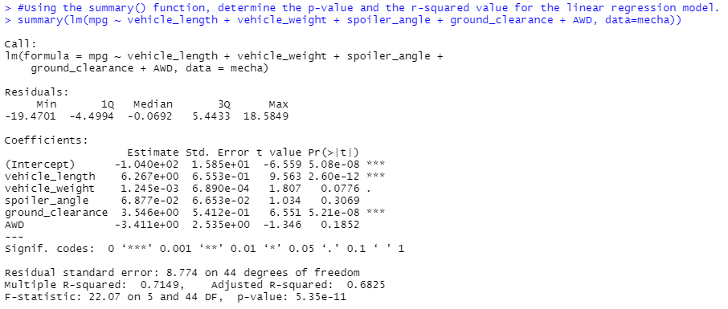
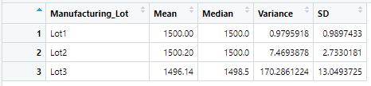
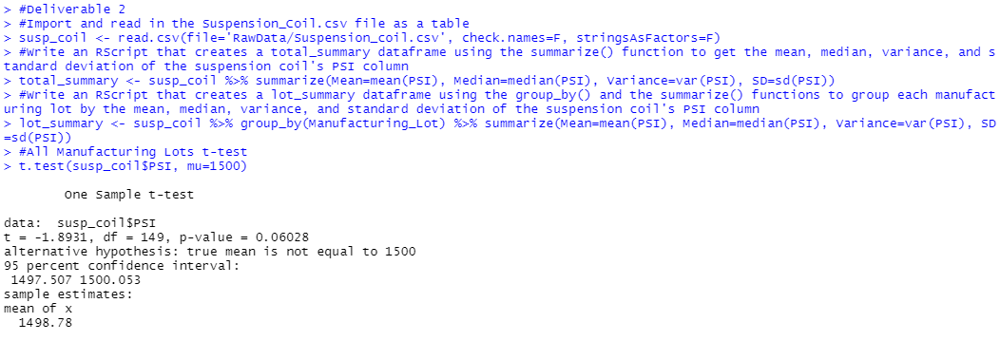
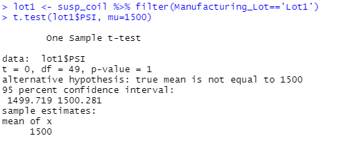
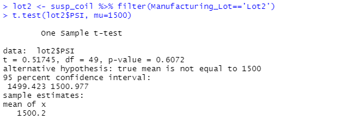
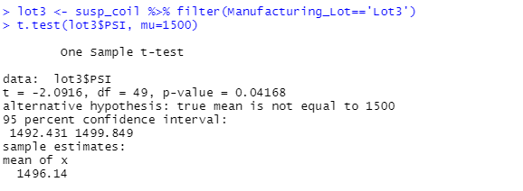

# MechaCar_Statistical_Analysis

## Deliverable 1: Linear Regression to Predict MPG
Perform multiple linear regression analysis to identify which variables in the dataset predict the miles-per-gallon (MPG) of MechaCar prototypes

Which variables/coefficients provided a non-random amount of variance to the mpg values in the dataset?
- Vehicle Length (vehicle_length) and Ground Clearance (ground_clearance) are statistically unlikely to provide random amounts of variance to the linear model. Vehicle Length having a p-value of 2.60e-12 and Ground Clearance having a p-value of 5.21e-08, indicating they are statistically significant on MPG.

Is the slope of the linear model considered to be zero? Why or why not?
- The p-value is below a significance level of 0.05%, meaning the slope of this model is not zero, indicating we are able to reject the null hypothesis.

Does this linear model predict mpg of MechaCar prototypes effectively? Why or why not?
- The R-squared value for this model is 0.7149 which means 71.5% of observed variations can be explained by this model, which means it can be a good model to predict MPG.

## Deliverable 2: Summary Statistics on Suspension Coils

Collect summary statistics on the pounds per square inch (PSI) of the suspension coils from the manufacturing lots

The design specifications for the MechaCar suspension coils dictate that the variance of the suspension coils must not exceed 100 pounds per square inch.
Does the current manufacturing data meet this design specification for all manufacturing lots in total and each lot individually?
Why or why not?

- The overall variance for all lots is 62.29 PSI, indicating design specifications are met when the three total are summarized together.
- Looking deeper, the summary of Lot 1 having a variance of 0.979 PSI and Lot 2 having a variance of 7.5 PSI; indicates both are inside design requirements.
- Suspension coils from Lot 3 on the other hand show a high variance of 170.27 PSI, outside of design specification requirements.

## Deliverable 3: T-Tests on Suspension Coils

Run t-tests to determine if the manufacturing lots are statistically different from the mean population

### Total of Three Lots t-test:
- P-Value for all lots is 0.06028 which is above our significance level of 0.05; fail to reject null hypothesis

### Lot 1 t-test
- P-Value for Lot 1 is 1, far above our significance level of 0.05: fail to reject null hypothesis.

### Lot 2 t-test
- P-Value for Lot 2 is 0.6072, also above our significance level of 0.05: fail to reject null hypothesis.

### Lot 3 t-test
- P-Value for Lot 3 is 0.04168, below our significance level of 0.05: reject null hypothesis.

## ONE
Design a Study Comparing the MechaCar to the Competition
- Design a statistical study to compare vehicle performance of the MechaCar vehicles against vehicles from other manufacturers. For each statistical analysis, you’ll write a 

summary interpretation of the findings.
- Statistical study on vehicle tailpipe emissions-MechaCar against competition

What metric or metrics are you going to test?

- Metrics:
-- vehicle emissions
-- City and highway fuel efficiencies.

What is the null hypothesis or alternative hypothesis?
- Null Hypothesis: MechaCar produces equal or more emissions than its competitors. To reject the Null Hypotheis to prove MechCar outperforms the competition, we need to collect fuel efficiency data for MechaCar and their competitors for the same type of cars. Null Hypothesis is that all of the cars in the same class have the same fuel efficiencies.
- Alternative Hypothesis: MechaCar produces less emissions than its competitors. The Alternative Hypothesis is that they are not all the same.

Here we can use Two Sample Test for fuel efficiency and check the difference between MEchaCar and competition.

What statistical test would you use to test the hypothesis? And why?
- T Tests can be run between MechaCar and individual competitors to show direct comparison
- ANOVA can be run between MechaCar and multiple competitors to show overall comparison

What data is needed to run the statistical test?
- Emissions from both MechaCar and its competitors

## TWO
Design Your Own Study

In general for MechaCar to outperform the competition there are couple of metrics we have to consider. For example Cost of the car, Fuel Efficiency, Repair Cost etc. Now a days people are looking for saving the car cost. 

The question I would ask what is fuel efficiency of MechaCar and the fuel efficiency of the competitor’s same type of car. Here we are comparing same fuel efficiency of same types of cars. 

Ho Hypothesis would be : The difference between out pair observations (the true mean difference) is equal to zero.
Ha: The difference between out pair observations (the true mean difference) is not equal to zero

To reject the H0 hypotheis to prove MechCar outperforms the competition we need to collect the fuel efficiency data for MechaCar and the competition same type of car. We can take top performing competition car and collects its fuel efficiency data.

Here we can use Two Sample Test for fuel efficiency and check the difference between MEchaCar and competition.

Example:
We have collected fuel efficiency data for mecharcar and top performing competition car (fule_efficiency_data). With the help of Two-Sample t.test(), can see is there is any statistical difference between the distribution means between two samples.

By using Two-Sample t.test() would give is p-value and if p-value is less that 0.05 then we can reject or keep the H0 hypothesis.

In term of R, if we collect the fuel efficiency data for same route and same distance for both MechaCar and the competitor’s (top) car then we would be able to verify our hypothesis. Here is sample R code we can test. Assuming we have fule_efficiency_data.

fule_effi_mecha <- fule_efficiency_data %>% filter(fule_efficiency=mecha_car_fule_effi)
fule_effi_competition <- fule_efficiency_data %>% filter(fule_efficiency=competition_car_fule_effi)

t.test(fule_effi_mecha$fule_efficiency, fule_effi_competition$fule_efficiency, paired=T)
Above equation will give us p-value and confidence level in our hypothesis and from that we can check our hypothesis.

## THREE
In this section, I am comparing how the MechaCar performs with the competition. I am not preforming any tests in R, I am talking about how I would go about completing this analysis. In order to do this I want to answer four different questions which are:

What metric or metrics are you going to test?
What is the null hypothesis or alternative hypothesis?
What statistical test would you use to test the hypothesis? And why?
What data is needed to run the statistical test?
The answer to these questions are:

The metrics I want to test are city and highway fuel efficiencies.
Null Hypothesis is that all of the cars in the same class have the same fuel efficienies. THe Alternative Hypothesis is that they are not all the same.
I would use an ANOVA test to complete this analysis for both types of fuel efficiencies. Also I would use the ggplot2 library to show the potential spread between different cars using a boxplot.
I would need fuel efficiency data from 50 individual cars to create a sample size of data for each car in the class type. For example, if there was 10 cars in the class type, I would have a top of 500 data points collected for each fuel efficiency type.

In your README, create a subheading ## T-Tests on Suspension Coils, then briefly summarize your interpretation and findings for the t-test results.
Include screenshots of the t-test to support your summary.

